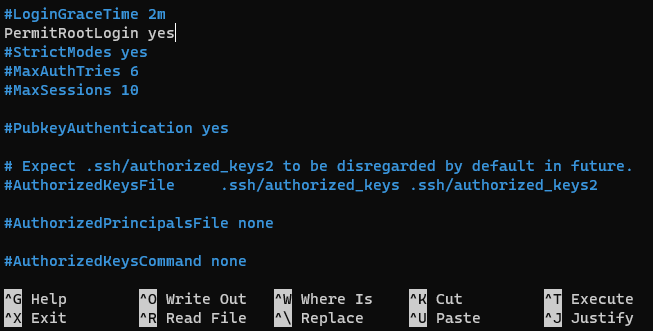
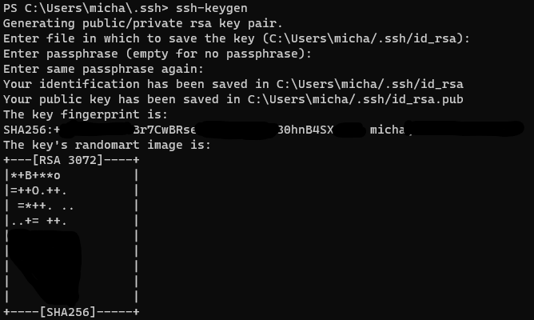
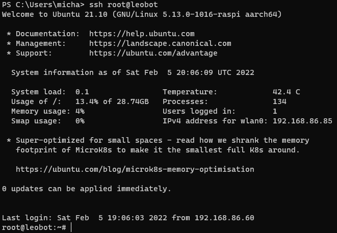

# Configuration of a Linux system for remote development (& debugging) (PART 1)

The goal is to develop an application remotely and test and debug it live on a remote device. To do this, I want to automatically prepare and transfer the project via Visual Studio Code in a way that makes it possible to debug the code directly on the device.

In the first part, we will prepare the device so that a connection works smoothly.

Date: 05.02.2022

<br>

## 1. Install Arm64 Linux System on Raspberry Pi or other ARM64 Board
In this case, I decided to use an ARM64 board, but a 32bit board can also be used. However, you should make sure that the processor supports at least ARMv7, otherwise dotnet will not work natively. The Raspberry Pi Zero 1 only has ARMv6 and can therefore NOT be used.

In my scenario, I use a Raspberry Pi 4. I use a normal 32GB class 10 micro SD card and install Ubuntu 21.10 Server via "Raspberry Pi Imager". I downloaded the image manually and selected it via the imager and wrote it to the sdcard.

Here you will find instructions for installing Ubuntu server. I did not install a desktop environment because I want the device to boot quickly and be ready.

https://ubuntu.com/tutorials/how-to-install-ubuntu-on-your-raspberry-pi#1-overview

```
Hint: Windows 11 already has all the ssh tools and you can use them directly in the terminal.
```

<br>

## 2. Configure Wifi
Now after following the tutorial, you should be able to connect to your Raspberry and log in.

In my case, however, there was the problem that the wifi connection was not established automatically and I needed to adjust the configuration files myself.

1. Connect via ssh
2. Change to root user
   ```
   sudo su
   ```

3. Edit network configuration file
   ```
   nano /etc/netplan/50-cloud-init.yaml
   ```
   You must be very careful with the spaces here! Change your SID and password!
   ```
   # This file is generated from information provided by the datasource.  Changes
   # to it will not persist across an instance reboot.  To disable cloud-init's
   # network configuration capabilities, write a file
   # /etc/cloud/cloud.cfg.d/99-disable-network-config.cfg with the following:
   # network: {config: disabled}
   network:
     version: 2
     wifis:
       wlan0:
         optional: true
         access-points:
           "YOURSID":
             password: "YOUR PASSWORD"
         dhcp4: true
   ```
   As already noted in the file, the cloud-init must be deactivated so that the changes also persist. To do this, the following command must be executed:
   ```
   echo "network: {config: disabled}" > /etc/cloud/cloud.cfg.d/99-disable-network-config.cfg
   ```
   Now you can restart the device at any time and it will already have an active wifi connection after the start and before the login.

<br>

## 3. Change hostname
If you want, you can change the hostname of the Raspberry Pi. This will allow you to access the device without an IP if your router/wifi supports it. To do this, simply edit the "/etc/hostname" file on the Raspberry Pi and then reboot.

```
sudo nano /etc/hostname
```
With ctrl + x you can save and close the file.

<br>

## 4. Configure ssh & login via ssh-key (password less)
So that we don't have to log in with a password all the time and so that we can do fully automatic deployment and debugging during development, we need a way to log in to the Raspberry Pi without a password.

We can do this very easily with an ssh key. With this key, our computer with user can log on to the Raspberry. The Raspberry Pi identifies this key and checks in its own small list if this computer with user is allowed to log in automatically.

Windows 11 again provides a very simple way to generate an ssh key. Then the public key must be transferred to the Raspberry Pi. Only then will the device know that our computer and user are authorised to log in automatically.

For the beginning, I will simply use the root user. So that I don't get any permission issues to communicate with the hardware. It is very important to understand that with the root user you have ALL permissions on the device and can therefore also make it unusable. However, this "only" refers to the software / operating system. In an emergency, you can simply rewrite the SD card :) (As long as you don't do hardware things :D)

1. Open Windows-Terminal
2. Login to Raspberry Pi
   ```
   ssh ubuntu@leobot
   ```
3. Enable root ssh login
   ```
   sudo nano /etc/ssh/sshd_config
   ```

   1. Press ctrl + w (for search)
   2. Input "root" press enter
   3. Remove Comment "#" for PermitRootLogin
   4. Enable Root Login
      
   5. Press ctrl + x for save
4. Restart ssh server
   ```
   sudo systemctl restart ssh
   ```
5. Exit ssh connection
   ```
   exit
   ```
6. Generate SSH-Key (on windows)
   ```
   ssh-keygen
   ```
   When asked for a password, simply press Enter twice. 

   Now it should look like this for you:
   

7. Transfer your id_rsa.pub to the device
   ```
   cat ~/.ssh/id-rsa.pub | ssh root@leobot "mkdir -p ~/.ssh && cat >> ~/.ssh/authorized_keys"
   ```

   Now you will be asked again for the root password, which you must enter here.

8. Login with root without password
   ```
   ssh root@leobot
   ```

   Now it should be possible to simply log in with root. You should no longer be asked for the password.

   

