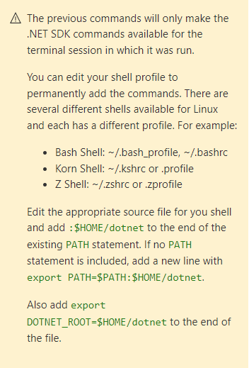

# Configuration of a Linux system for remote development (& debugging) (PART 2)

In the second part, we focus on the possibility of creating a service via Visual Studio Code (VSC) and transferring it automatically to the Raspberry Pi and then debugging it in VSC. In other words, we can update and run the software on the device via VSC at any time.

Date: 07.02.2022

<br>

## Install dotnet

1. Connect to the device via ssh
2. Download & extract dotnet sdk
   
   Make sure you download the right architecture, in my case Arm64

   https://dotnet.microsoft.com/en-us/download/dotnet/6.0
   ```
   wget https://download.visualstudio.microsoft.com/download/pr/d43345e2-f0d7-4866-b56e-419071f30ebe/68debcece0276e9b25a65ec5798cf07b/dotnet-sdk-6.0.101-linux-arm64.tar.gz
   ```
3. Extract & install dotnet
   ```
   mkdir -p $HOME/dotnet && tar zxf dotnet-sdk-6.0.101-linux-arm64.tar.gz -C $HOME/dotnet
   export DOTNET_ROOT=$HOME/dotnet
   export PATH=$PATH:$HOME/dotnet
   ```
4. Persist installation
   
   

5. Link dotnet
   To make dotnet work without login, dotnet has to be linked into the default bin directory:
   ```
   ln -s /root/dotnet/dotnet /bin/dotnet
   ```
6. Test dotnet
   
   Now you should be able to run dotnet:

   ```
   dotnet --version
   ```

<br>

## Install vsdbg (Debugger)

To be able to connect directly to the Raspberry for debugging, we need a debugger proxy. With this you can start a dotnet application and debug it.

1. Download the tool:
   ```
   wget https://aka.ms/getvsdbgsh -O - 2>/dev/null | /bin/sh /dev/stdin -v latest -l ~/vsdbg
   ```

2. Create link for everyone
   ```
   ln -s /root/vsdbg/vsdbg /bin/vsdbg
   ```

3. Test the debugger
   ```
   vsdbg -?
   ```

<br>

## Ready for development
Now we have all the components set up so that we can start developing.

In the next step we will create a service and transfer it to the Raspberry Pi & start it.