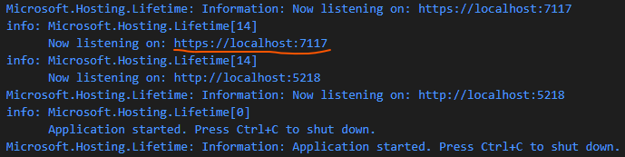
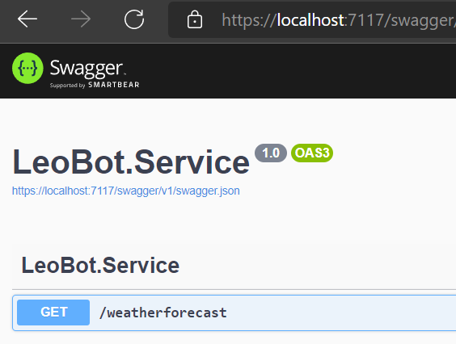
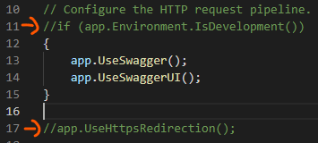
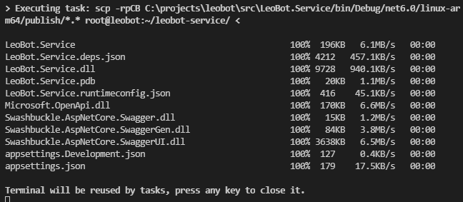
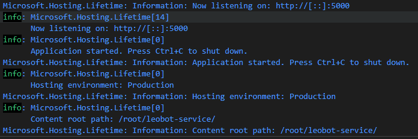
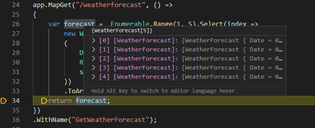

# Create a rest webapi application & deploy/debug on device

This step is about creating a web service that is fully automatically deployed and started on the Raspberry Pi. Full debug functionality should be given in Visual Studio Code. At the end of this step we will have WebApi running on the Raspberry Pi and be able to call it from our Windows 11 machine.

Date: 07.02.2022

<br>

## Create First Service

1. Open the project folder in your Windows Terminal
2. First we create a src folder

   ```
   mkdir src
   cd .\src
   ```
3. Create webapi service
   ```
   dotnet new webapi -minimal -o LeoBot.Service
   ```
4. Open your new servvice
   ```
   cd .\LeoBot.Service
   code .
   ```

   Now VSC should open and your project should be visible in the explorer. If you are using VSC for the first time with dotnet, you should install the following extensions:
   - C#
   - C# Extensions
   - C# Helper

<br>

## First start of your Service

1. Open "Program.cs" File
2. Hit F5
3. Confirm that you want to start a ".NET Core" application.
4. Hit F5 again
   
   You should now see many messages in the "Debug Console". However, the message on which https port our service is now running is important here:
   
   

   In my case it is port 7117. You can now click (ctrl + click) to open the page. You will probably see a 404 page. Then you have to write "/swagger" at the end of the url.

      

   Now you have a fully functional WebApi already running on your Windows PC. Next, we need to configure Visual Studio Code so that we can run the service on the Raspberry Pi.

5. Stops the application via the red rectangle (or Shift + F5)

<br>

## Deploy & Run on device
Now we will prepare the service so that we can run it on our Raspberry Pi.

1. Open "Program.cs"
2. Remove or comment out following lines:
   
     

   In line 11 we deactivate the check that we are in a development environment. This means that the Swagger UI is always added, even in release mode. In line 17 we deactivate the HTTPS redirect, so that we can also access our service with HTTP and do not need an HTTPS certificate.

3. Open "Properties/launchSettings.json"
   Here we can configure how our application should be started. First we remove all settings for IIS.
   Next, we disable the autostart from the web browser and change ApplicationUrl. 
   
   At the end, the file should look like this:
   ```
   {
     "$schema": "https://json.schemastore.org/launchsettings.json",
     "profiles": {
       "LeoBot.Service": {
         "commandName": "Project",
         "dotnetRunMessages": true,
         "launchBrowser": false,
         "applicationUrl": "http://*:5000",
         "environmentVariables": {
           "ASPNETCORE_ENVIRONMENT": "Development"
         }
       }
     }
   }
   ```

4. Open "appsettings.json"
   Here the port must be configured so that the application on the Raspberry Pi uses the correct port.
   ```
   {
     "Urls": "http://*:5000",
     "Logging": {
       "LogLevel": {
         "Default": "Information",
         "Microsoft.AspNetCore": "Warning"
       }
     },
     "AllowedHosts": "*"
   }
   ```

5. Open ".vscode/tasks.json"
   Now we need to create a task that copies our application to the Raspberry Pi.

   Replace the publish task with that:
   ```
   {
       "label": "publish",
       "command": "cmd",
       "type": "shell",
       "args": [
           "/c",
           "dotnet publish -r linux-arm64 -c Debug --no-self-contained",
       ],
       "problemMatcher": []
   }
   ```

   Add new task for remote publish:

   This task creates a folder "leobot-service" under /root/ and copies the publish folder over via scp.
   ```
   {
       "label": "remotePublish",
       "type": "shell",
       "dependsOn": "publish",
       "command": "scp -rpCB ${workspaceFolder}/bin/Debug/net6.0/linux-arm64/publish/*.* root@leobot:~/leobot-service/",
       "problemMatcher": []
   }
   ```

   Now you can test the transfer with hit F1 -> "run task" -> "remotePublish". You should see the following output at the end:

   

6. Open ".vscode/launch.json"
   
   The last step is to create the launch configurations. In my case, I create two different ones. One will run the complete process: Build -> Publish -> Transfer -> Launch (with / without debugger). The other configuration will only launch the debugger without re-transferring everything first. This can be useful if you haven't made any changes to the code but want to debug several times.

   Now add the following configurations:

   ```
   {
       "name": "Publish & Copy & Remote Launch",
       "preLaunchTask": "remotePublish",
       "type": "coreclr",
       "request": "launch",
       "program": "dotnet",
       "args": [
           "LeoBot.Service.dll"
       ],
       "cwd": "~/leobot-service/",
       "stopAtEntry": false,
       "justMyCode": true,
       "pipeTransport": {
           "pipeCwd": "${workspaceRoot}",
           "pipeProgram": "ssh",
           "pipeArgs": [
               "-T",
               "root@leobot"
           ],
           "debuggerPath": "vsdbg"
       },
       "sourceFileMap": {
           "~/leobot-service/": "${workspaceFolder}"
       },
       "symbolOptions": {
           "searchMicrosoftSymbolServer": false
       }
   },
   {
       "name": "Only Remote Launch",
       "type": "coreclr",
       "request": "launch",
       "program": "dotnet",
       "args": [
           "LeoBot.Service.dll"
       ],
       "cwd": "~/leobot-service/",
       "stopAtEntry": false,
       "justMyCode": true,
       "console": "internalConsole",
       "pipeTransport": {
           "pipeCwd": "${workspaceRoot}",
           "pipeProgram": "ssh",
           "pipeArgs": [
               "-T",
               "root@leobot"
           ],
           "debuggerPath": "vsdbg"
       },
       "sourceFileMap": {
           "~/leobot-service/": "${workspaceFolder}"
       },
       "symbolOptions": {
           "searchMicrosoftSymbolServer": false
       }
   }
   ```

<br>

## You did it!
Now we have everything configured and can really run and debug our application on the Raspberry Pi.

1. Open "Run and debug" Tab (ctrl + shift + D)
2. Select "Publish & Copy & Remote Launch"
3. Click on the green "Run" button
   Nach einer kurzen Zeit wirst du sehen, dass der Service gestartet wurde:

   

4. Now you can open the browser and go to the following url: 
   
   http://leobot:5000/swagger

5. Debug program.cs
   Set a breakpoint and execute the endpoint "weatherforecast" via swagger.
   
   
   
